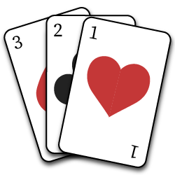

<p align="center">
  
</p>

<h1 align="center">Deckbuilder</h1>

<p align="center">A deck building and management tool any card based games in the browser or Node.<p>

<div align="center">

  [](https://www.npmjs.com/package/deckbuilder)
  [](https://snyk.io/test/github/robertcorponoi/deckbuilder)
  [](https://www.npmjs.com/package/deckbuilder)
  <a href="https://badge.fury.io/js/deckbuilder"></a>
  <a href="https://badge.fury.io/js/deckbuilder"></a>
  [](https://gitter.im/robertcorponoi)

</div>

## **Installation**

Deckbuilder can be used by referencing the deckbuilder.js script or through NPM:

```
$ npm install --save deckbuilder
```

and to use it, you can require it in your project:

```js
const Deckbuilder = require('deckbuilder');
```

To use Deckbuilder in the browser, you can use it as an ES6 module:

```js
import Deckbuilder from './node_modules/deckbuilder/deckbuilder.js';
```

## **Initialization**

After installing Deckbuilder, a new deck can be created like so:

```js
const deckbuilder = new Deckbuilder();
```

Currently, there is only one option available when creating a new deck.

| param               | type   | description                                          | default  |
|---------------------|--------|------------------------------------------------------|----------|
| options             | Object |                                                      |          |
| options.maxDeckSize | number | The maximum number of cards that can be in the deck. | Infinity |

So if you wanted to limit the amount of cards in the deck to 30, you could initialize Deckbuilder as so:

```js
const deckbuilder = new Deckbuilder({ maxDeckSize: 30 });
```

## **Card Structure**

Before we get into the API, it's important to to talk about the card structure that Deckbuilder expects and it's actually pretty simple.

Deckbuilder assumes just two things about your cards.

1. Each card must be an object with key value pairs.

2. Each card can have any properties you wish but they must all have an id property. This id property is how Deckbuilder will know what cards you're referring to when performing other actions.

Here is an example of a valid card:

```js
let sampleCard = {
  id: 'knight',
  attack: 5,
  defence: 10,
  description: 'A mighty knight'
};
```

An `id` property can be a string or a number so the following is also a valid card:

```js
let sampleCard2 = {
  id: 54,
  color: 'blue'
};
```

## **API**

Deckbuilder has many (hopefully all of the) methods you need to create and manage any kind of deck.

* [Add one or more cards to the deck](#add)
* [Remove one or more cards from the deck](#remove)
* [Edit a card in the deck](#edit)
* [Shuffle the deck](#shuffle)
* [Deal a number of cards to a number of players](#deal)
* [Draw a number of cards from the deck](#draw)
* [Pick specific cards from the deck](#pick)
* [Send cards to the discard pile](#discard)
* [Return cards from the drawn pile back to the deck](#returnDrawn)
* [Return cards from the discarded pile back to the deck](#returnDiscarded)

### **add**

Add takes one or more cards and adds them to the deck. A single card can be added as an object or multiple cards can be added as an array of objects.

| param     | type                       | description                                                                                                                                                                                            | default |
|-----------|----------------------------|--------------------------------------------------------------------------------------------------------------------------------------------------------------------------------------------------------|---------|
| cards     | Object or Array of Objects | The card or cards to add to the deck.                                                                                                                                                                  |         |
| shuffleIn | boolean                    | Normally the card is just added to the end of the deck because the deck is usually shuffled before playing anyways. If this is specified, the card/s are shuffled in at a random location in the deck. | false   |

The `shuffleIn` parameter could be useful if you're adding a card to the deck during the game and you would like to place it in a random location in the deck.

```js
const cards = [
  {
    id: 1,
    atk: 5,
    def: 10
  },
  {
    id: 2,
    atk: 1,
    def: 3
  },
  {
    id: 3,
    atk: 10,
    def: 2
  }
];

deckbuilder.add(cards);
```

### **remove**

Remove one or more cards from the deck. Cards to be removed are specified by id and multiple cards can be removed by providing an array of ids.

| param | type                                      | description                                         | default |
|-------|-------------------------------------------|-----------------------------------------------------|---------|
| ids   | string/number or Array of strings/numbers | The id or ids of the cards to remove from the deck. |         |

```js
deckbuilder.remove([1, 3]);
```

### **edit**

Edit a single card in the deck.

| param    | type             | description                               | default |
|----------|------------------|-------------------------------------------|---------|
| id       | string or number | The id of the card to edit.               |         |
| editInfo | Object           | The properties to add, change, or remove. |         |

To specify a new property for the card, just simply set a new key and value pair.

To change a property for the card, specify the existing key and the new value.

To remove a property from the card, specify the existing key and set the value to null and Deckbuilder will know to remove it.

Let's take the following card from the deck:

```js
{
  id: 2,
  atk: 1,
  def: 3
}
```

We are going to add a new property to the card, a description so our users will know what the card is. Then we will edit the atk property because we want to make this card stronger. Lastly we will remove the def property because the best defence is a strong offense right?

```js
deckbuilder.edit(2, { description: "A very mighty beast!", atk: 10, def: null });
```

### **shuffle**

Shuffle the cards in the deck using a specified shuffling method any number of times.

| param     | type                         | description                                            | default                                   |
|-----------|------------------------------|--------------------------------------------------------|-------------------------------------------|
| times     | number                       | The number of times to repeat the shuffle on the deck. |                                           |
| technique | deckbuilder.shuffleTechnique | The shuffling technique to use on the deck.            | deckbuilder.SHUFFLE_METHODS.FISHERYATES |

To avoid typos, the shuffling technique must be provided from the available `deckbuilder.SHUFFLE_METHODS` object.

The current possible shuffle techniques (with more on the way) are:

1. FISHERYATES: One of the best array shuffling methods available.

2. STRIP: Removes a part of the deck and places it in another part of the deck.

By default, the `SHUFFLE_METHODS.FISHERYATES` method is used as it is very good at shuffling the deck.

Shuffling the deck using the fisherYates method 2 times:

```js
deckbuilder.shuffle(2);
```

Shuffling the deck using the strip method 5 times:

```js
deckbuilder.shuffle(5, deckbuilder.SHUFFLE_METHODS.STRIP);
```

### **deal**

Deal out a number of cards from the top of the deck to a number of hands. This should be used when each player is getting the same amount of cards.

The cards will be dealt in a 'clockwise' fashion so each player will get one card at a time.

The cards that are dealt from the deck will be added to the `deckbuilder.drawn` pile so that they cannot be drawn again.

| param | type   | description                               | default |
|-------|--------|-------------------------------------------|---------|
| hands | number | The number of hands to deal cards to.     |         |
| cards | number | The number of cards to deal to each hand. |         |

The following will deal 2 cards to 5 people:

```js
const hands = deckbuilder.deal(2, 5);

// Hands will be equal to:
{
  1: [{ /* Card */ }, { /* Card */ }],
  2: [{ /* Card */ }, { /* Card */ }],
  3: [{ /* Card */ }, { /* Card */ }],
  4: [{ /* Card */ }, { /* Card */ }],
  5: [{ /* Card */ }, { /* Card */ }],
}
```

### **draw**

Draw any number of cards from the top of the deck.

The cards that are drawn from the deck will be added to the `deckbuilder.drawn` pile so that they cannot be drawn again.

| param | type   | description                               | default |
|-------|--------|-------------------------------------------|---------|
| cards | number | The number of cards to draw from the deck |         |

```js
const draw = deckbuilder.draw(2);

// Draw will be equal to:
[{ /* Card */ }, { /* Card */ }]
```

### **pick**

Pick lets you choose any number of cards from the deck by their id. This is handy when you need to draw one or more specific cards.

A single card can be picked by id or multiple cards can be picked by an array of ids.

The cards that are picked from the deck will be added to the `deckbuilder.drawn` pile so that they cannot be drawn again.

| param | type                                      | description                        | default |
|-------|-------------------------------------------|------------------------------------|---------|
| ids   | string/number or Array of strings/numbers | The id or ids of the cards to draw |         |

```js
const pick = deckbuilder.pick(['knight', 'warrior']);

// Pick will be equal to:
[{ /* Knight Card */ }, { /* Warrior Card */ }]
```

### **discard**

Discard one or more cards from the drawn pile and optionally the deck.

A single card can be discarded by id or multiple cards can be discarded by an array of ids.

Cards that are picked discarded will be moved to the `deckbuilder.discarded` pile.

| param | type                                      | description                                                                                                                         | default |
|-------|-------------------------------------------|-------------------------------------------------------------------------------------------------------------------------------------|---------|
| ids   | string/number or Array of strings/numbers | The id or ids of the cards to discard                                                                                               |         |
| deck  | boolean                                   | Indicates whether the deck should also be checked for the cards to discard. By default, this method will only check the drawn pile. | false   |

```js
deckbuilder.discard(['knight', 'mage']);
```

### **returnDrawn**

Returns one or more cards to the deck from the drawn pile. If no card ids are specified to be removed, all cards from the drawn pile will be returned to the deck.

| param             | type                                      | description                                                                                                                                | default |
|-------------------|-------------------------------------------|--------------------------------------------------------------------------------------------------------------------------------------------|---------|
| ids               | string/number or Array of strings/numbers | The cards to to return back to the deck by id                                                                                              | []      |

Return specific cards back to the deck:

```js
deckbuilder.returnDrawn([1, 2]);
```

Return all drawn cards back to the deck.

```js
deckbuilder.returnDrawn();
```

### **returnDiscarded**

Returns one or more cards to the deck from the discarded pile. If no card ids are specified to be removed, all cards from the discarded pile will be returned to the deck.

| param             | type                                      | description                                                                                                                                | default |
|-------------------|-------------------------------------------|--------------------------------------------------------------------------------------------------------------------------------------------|---------|
| ids               | string/number or Array of strings/numbers | The cards to to return back to the deck by id                                                                                              | []      |

Return specific cards back to the deck:

```js
deckbuilder.returnDiscarded([1, 2]);
```

Return all discarded cards back to the deck.

```js
deckbuilder.returnDiscarded();
```

## **License**

MIT